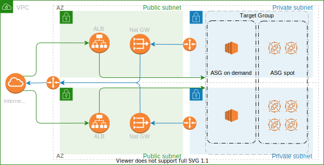

# AWS Simple Architecture

## Architecture

This is a project of a simple architecture on AWS using Terraform to provide as infrastructure as Code.

There are some instances on-demand and some spots, these instances are in a Target Group of an ALB and will host some web server, inside a private subnet.
Also these instances will have outgoing traffic to the internet through the Nat Gateway with some EIP and they won't receive incoming traffic directly from the internet.
The ALB will receive incoming traffic from internet only on specific ports.

The architecture is the following:



## Up and Running

```bash
chmod +x deploy.sh && \
  bash deploy.sh
```
